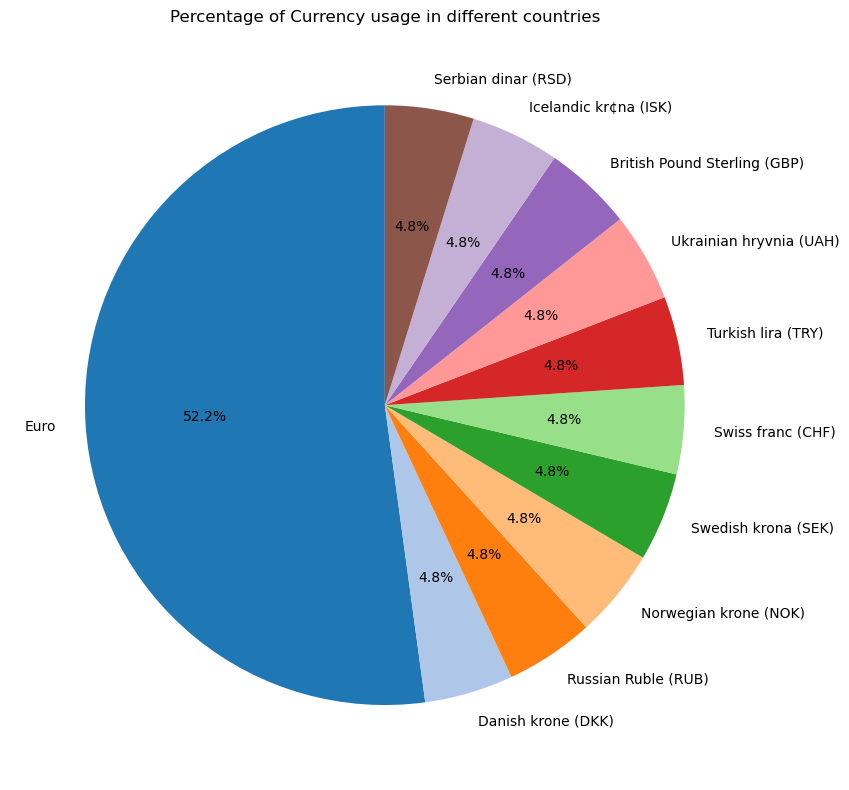
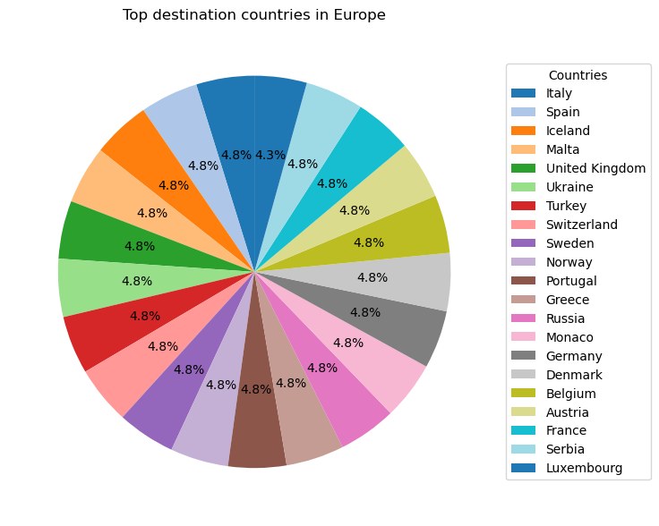
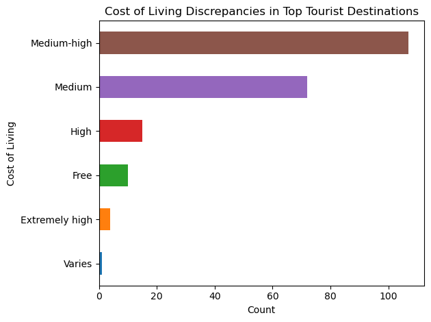
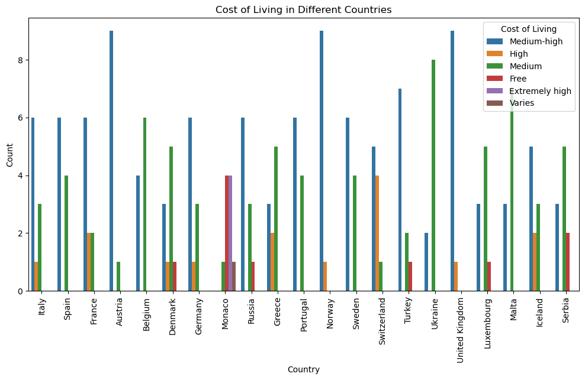
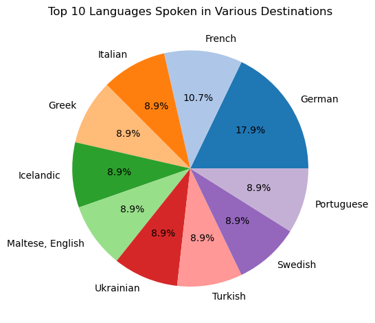
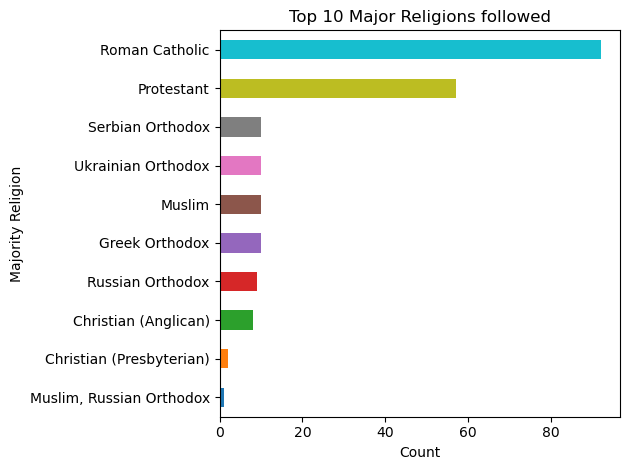

# Overview
Welcome to my analysis of Top Europe Destinations dataset where I attempt to analyze the tourism trends, homestay trends, and different food and culture around the destinations. 

This dataset was imported from Kaggle official website and I have used various tools and visualizations to make this analysis insightful.

# Tools I used
For this analysis project, I used several key tools:

- Python: This is the backbone of my analysis which helped me with overall project operations. I have used following Python libraries:
   
    - Pandas Library: This was used to analyze data.
    - Matplotlib library: I visualized the data.
    
- Jupyter Notebook: The tool I used to run my Python Scripts which let me easily include my notes and analysis. 
- Visual Studio Code: My go-to for executing my Python Scripts. 
- Git and GitHub: Essential for version control and sharing my Python code and analysis, ensuring collaboration and initialization.

# The Visualizations
## Percentage of Currency Usage in different countries
```Python
plt.figure(figsize= (10, 8))

df_europe['Currency'].value_counts().plot(
    kind = 'pie',
    autopct = '%1.1f%%',        # Display Percentage
    startangle = 90,            # Start at 90 degree to make it visually balanced
    colors = plt.get_cmap('tab20').colors       #Use distinct colors from a colormap
    )  


plt.title('Percentage of Currency usage in different countries')
plt.ylabel('')

plt.tight_layout()

plt.show()
```

*Top Currencies used in Europe*

## Top Destinations(Countries)
```Python
plt.figure(figsize= (8,6))
df_europe['Country'].value_counts().plot(
    kind = 'pie',
    startangle = 90,
    autopct = '%1.1f%%',
    colors= plt.get_cmap('tab20').colors,
    labels = None       # This removes labels from around the pie chart
)
```

*Top Destination Countries*

## Cost of Living Discrepancies in Top Tourist Destinations

```Python
df_europe['Cost of Living'].value_counts(ascending= True).plot(
    kind = 'barh',
    color = plt.get_cmap('tab10').colors
)
plt.title('Cost of Living Discrepancies in Top Tourist Destinations')
plt.xlabel('Count')
plt.tight_layout()
```

*Cost of Living Discrepancies*

## Overall Cost of Living in different countries

``` Python
plt.figure(figsize=(12, 6))

sns.countplot(x='Country', hue='Cost of Living', data=df_europe)

plt.title('Cost of Living in Different Countries')
plt.xlabel('Country')
plt.ylabel('Count')
plt.xticks(rotation=90)
plt.legend(title='Cost of Living')
plt.show()

```

*Overall cost of living in top destinations*

## Top 10 Languages spoken in different destinations
``` Python
df_europe['Language'].value_counts().head(10).plot(
    kind = 'pie',
    colors = plt.get_cmap('tab20').colors,
    autopct = '%1.1f%%'
)
plt.title('Top 10 Languages Spoken in Various Destinations')
plt.tight_layout()
plt.ylabel('')

```

*Top 10 Languages Spoken in Various Destinations*

## Top 10 Major Religions followed

``` Python
df_europe['Majority Religion'].value_counts(ascending= True).head(10).plot(
    kind = 'barh',
    color = plt.get_cmap('tab10').colors   
)

plt.title('Top 10 Major Religions followed')
plt.xlabel('Count')
plt.tight_layout()
plt.show()
```

*Majority Religion Followers*

